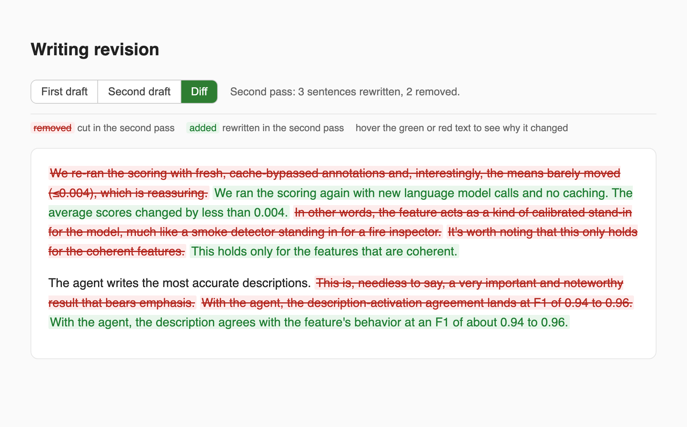

# Plain writing skill

This is a writing-style skill for AI agents. It makes an agent write and edit
prose in a plain style. The rules cover word choice, punctuation, sentence
length, and they cut filler. See `SKILL.md` for the full list.

It is packaged as a skill for Claude Code, but the rules in `SKILL.md` are plain
text and work for any agent that can read a style guide.

The skill also does a second pass over its own writing. The second pass removes
any clause that does not add something the reader needs. When that pass changes
the text, the skill writes an HTML file that shows what changed, so you can
check the edits.

## What is in here

- `SKILL.md`: the skill, with the rules and the steps.
- `assets/revision_template.html`: the template for the change view. The skill
  fills it in with the edits it made.

## How to install in Claude Code

Skills live in `~/.claude/skills`. Put these files in a folder named
`plain-writing` there.

With git:

```
git clone https://github.com/shreyashankar/plain-writing-skill ~/.claude/skills/plain-writing
```

Or download the files and copy them so the layout looks like this:

```
~/.claude/skills/plain-writing/
  SKILL.md
  assets/revision_template.html
```

Claude Code finds the skill the next time it starts.

## How to use it

Ask Claude to write or revise something, or to simplify or clean up text. The
skill applies the rules on its own. You can also ask for it by name.

When the second pass changes the text, the skill writes an HTML file to `/tmp`.
The file has three tabs:

- First draft
- Second draft
- Diff

In the Diff tab the removed text is red and the rewritten text is green. The
reason for each change appears when you hover the colored text.


